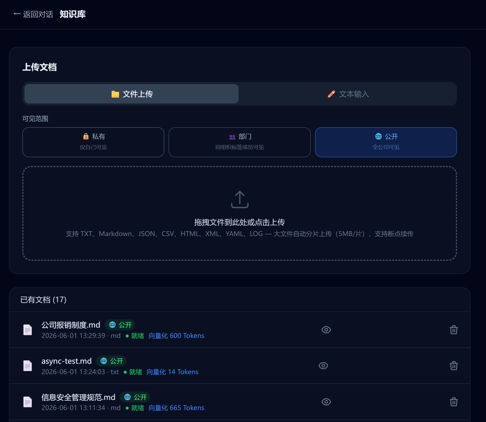
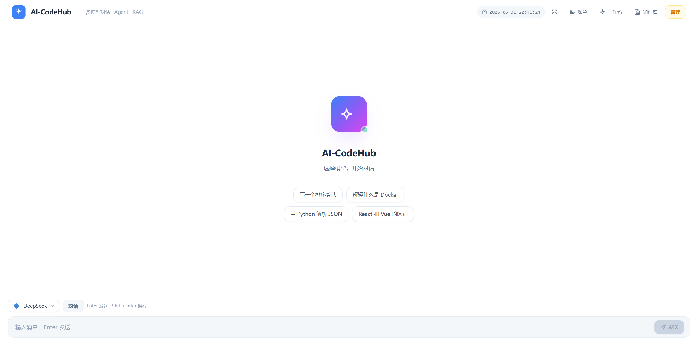
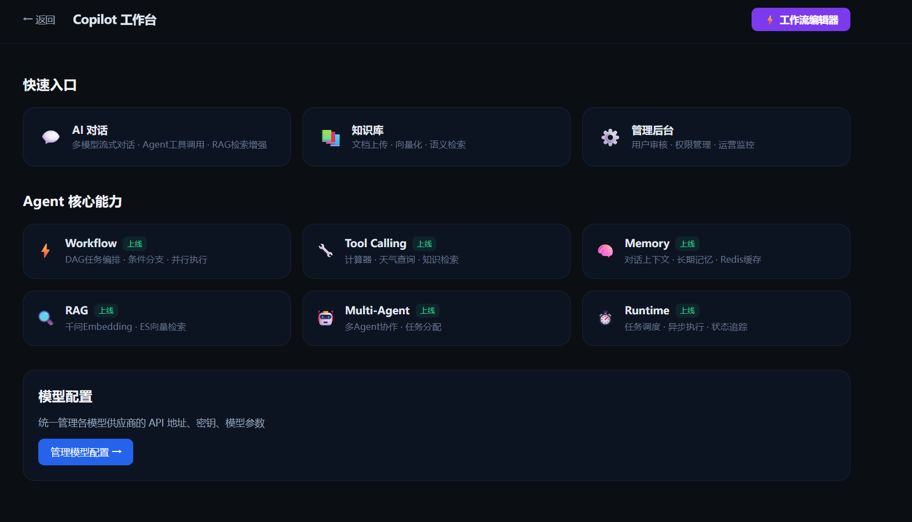
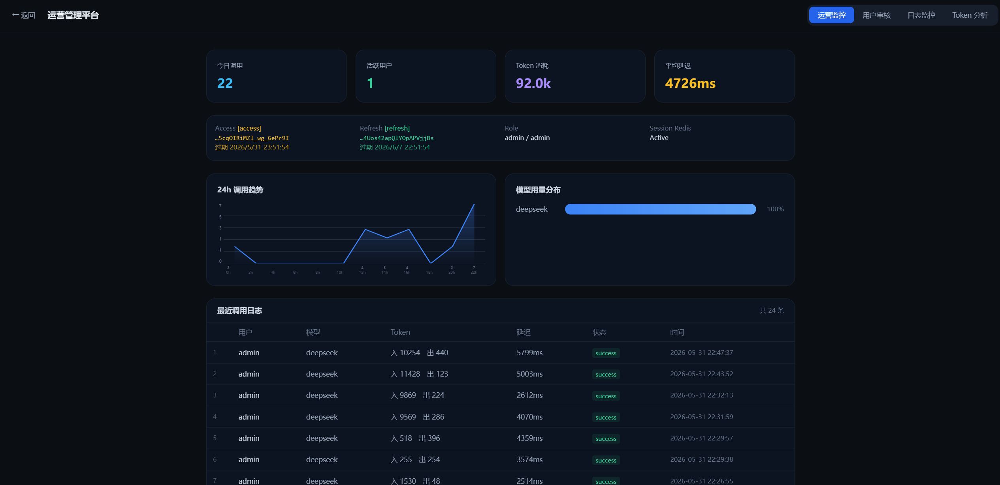

# AI-CodeHub

企业级 AI 协作平台，提供**知识库管理、智能对话、可视化工作流**三大核心功能。前端 React + TypeScript + Tailwind CSS，后端 Spring Boot 3 + MyBatis-Plus，Docker Compose 一键部署。

## 核心功能

| 功能 | 说明 | 页面入口 |
|------|------|------|
| **知识库** | 文档上传 + 三级权限隔离（私有/部门/公开）+ RAG 检索 + 来源标注 | `/rag` |
| **智能对话** | 多模型流式对话 + Agent 工具调用（11 个内置工具）+ 记忆系统 + ReAct 决策循环 | `/` |
| **工作流** | React Flow 可视化 DAG 编排 + LLM/Agent/工具/条件六种节点 + 并行执行 | `/copilot/workflow` |

## 使用场景

## 技术栈

| 层级 | 技术 | 版本 |
|------|------|------|
| 前端框架 | React + TypeScript | 18 / 5.4 |
| 构建工具 | Vite | 5 |
| CSS 方案 | Tailwind CSS | 3.4 |
| 图编辑器 | @xyflow/react (React Flow) | 12 |
| 后端框架 | Spring Boot | 3.2 |
| ORM | MyBatis-Plus | 3.5 |
| 数据库 | MySQL | 8.0 |
| 缓存 | Redis | 7 |
| 搜索引擎 | Elasticsearch | 8.13 |
| 对象存储 | MinIO | latest |
| 向量模型 | 千问 text-embedding-v4 | 2048维 |
| 鉴权 | Spring Security RBAC + JWT + BCrypt | - |
| 容器化 | Docker + Docker Compose | - |

## 文档权限模型

| 可见级别 | 可见范围 | 适用场景 |
|---------|---------|---------|
| PRIVATE | 仅上传者本人 | 个人笔记、草稿 |
| DEPARTMENT | 同部门成员 | 部门周报、技术方案、内部流程 |
| PUBLIC | 全公司（含管理员） | 公司制度、公告、通用规范 |

管理员拥有所有文档的全局可见权限。

```
ES 检索过滤:
  Admin       → 无过滤，可见全部文档
  PUBLIC      → 所有人可见
  DEPARTMENT  → 仅同 org_tag 成员（支持层级穿透）
  PRIVATE     → 仅上传者本人
```

## 组织架构

支持自定义部门层级（默认内置开发部/运营部/财务部作为示例），管理员可灵活扩展。组织标签支持父子层级穿透，成员可归属多个标签。

## 项目结构

```
AI-CodeHub/
├── docker-compose.yml              # 12 服务编排
├── .env                            # 环境变量
├── README.md
├── docs/
│   ├── databases/init.sql          # 完整建表语句
│   ├── README.md                   # 平台场景总览 + 权限矩阵
│   ├── scenarios/customer-service/ # 场景文档
│   │   └── KNOWLEDGE_STRUCTURE.md  # 知识库文档结构建议
│   ├── CHANGELOG.md                # 完整更新日志
│   ├── ROADMAP.md                  # 升级改造路线
│   └── PRODUCTION.md               # 生产环境清单
├── backend/
│   ├── Dockerfile
│   ├── pom.xml
│   └── src/main/java/com/aicodehub/
│       ├── controller/             # Chat / Agent / Workflow / Admin / Documents
│       ├── service/
│       │   ├── agent/              # ReAct 循环 + AgentBudget + CrewAI 多Agent
│       │   ├── tool/builtin/       # 11 个 Agent 工具（含知识库检索/摘要/反馈/统计/MCP）
│       │   ├── rag/                # RAG（Embedding + ES 检索 + Kafka 消费）
│       │   ├── ChunkedUploadService # 分片上传 + Redis bitmap + MinIO composeObject
│       │   └── ...
│       ├── entity/                 # User / OrgTag / Document / FileUpload / Permission...
│       ├── common/                 # 统一响应、SSE、WebSocket、JWT、UserContext
│       └── config/                 # Security / RBAC / JwtAuthFilter / PromptConfig / MinioConfig / KafkaConfig
│   └── resources/
│       ├── application.yml
│       └── prompts/                # 系统提示词（assistant / knowledge / workflow / agent）
└── frontend/
    ├── Dockerfile
    ├── nginx.conf
    └── src/
        ├── pages/                  # ChatInterface / CopilotOverview / RagPanel / AdminPanel
        ├── components/             # Sidebar / FlowCanvas / ModelSelector / LoginModal
        ├── store/                  # Zustand 状态管理
        └── hooks/                  # useWebSocket 等
```

## 本地开发

### 1. 环境要求

- Docker Desktop
- 复制 `.env.example` 为 `.env`，填写所需模型的 API Key

### 2. 端口

| 端口 | 服务 |
|:--|:--|
| 3000 | Nginx 前端 |
| 8080 | Spring Boot 后端 |
| 3306 | MySQL |
| 6379 | Redis |
| 9200 | Elasticsearch |
| 9000 | MinIO API |
| 9001 | MinIO 控制台 |

### 3. 启动

Docker Compose 一键部署，从 `docker compose up -d` 到可用只需一条命令。

```bash
cd AI-CodeHub
cp .env.example .env   # 首次运行，填写 API Key
docker compose up -d --build
```

### 4. 访问

| 页面 | 地址 |
|------|------|
| 对话界面 | http://localhost:3000 |
| Copilot 概览 | http://localhost:3000/copilot |
| 工作流编辑器 | http://localhost:3000/copilot/workflow |
| 知识库管理 | http://localhost:3000/rag |
| 模型配置 | http://localhost:3000/model-config |
| 管理后台 | http://localhost:3000/admin |
| MinIO 控制台 | http://localhost:9001 |

### 5. 停止

```bash
docker compose down
```

## 功能详情

### 知识库
- 文档上传支持三级可见性：PRIVATE / DEPARTMENT / PUBLIC
- 千问 text-embedding-v4 向量化 → ES kNN+BM25 混合检索
- 组织标签层级穿透，ES 检索按权限自动过滤
- 上传支持 Markdown/TXT，手动粘贴或文件拖拽 + MinIO 对象存储



### 智能对话
- WebSocket 全双工流式输出，打字机效果 + Markdown 渲染
- Agent ReAct 决策循环：`while(true)` 最大 5 轮迭代 + 16000 token 预算
- 内置 11 个工具：rag_search / summarize / knowledge_stats / web_search / calculator / datetime / weather / mcp / save_memory / search_memory / save_feedback
- 多模型支持：GPT / 智谱 / 千问 / DeepSeek / OpenAI 兼容
- 记忆系统：三层架构 + Map-Reduce 压缩 + ES 向量语义检索



### 工作流
- React Flow 画布，拖拽式 DAG 编排
- 节点类型：输入/输出/LLM/Agent/工具/条件分支
- 拓扑排序 + 并行层执行 + SSE 流式输出



### 运营监控（管理员）
- Grafana + Prometheus + Loki 全栈可观测
- Token 消耗分析（各阶段分布 + 分页明细）
- 用户审核 + 调用日志审计 + 24h 趋势图



详细说明见 [`docs/README.md`](docs/README.md)，知识库结构见 [`docs/scenarios/customer-service/`](docs/scenarios/customer-service/)，更新记录见 [`docs/CHANGELOG.md`](docs/CHANGELOG.md)，路线规划见 [`docs/ROADMAP.md`](docs/ROADMAP.md)。
